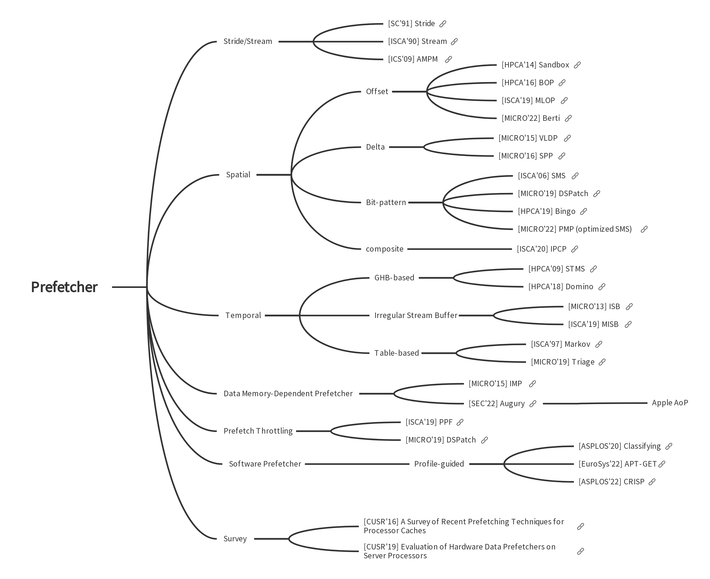

# Thoughts

* 在coverage/accuracy/timeliness这几个指标中，最重要的是timeliness
* BOP因为及时性好，所以性能表现很好。而且开销很小。
	* BOP必须支持跨page，包含大offset, 否则发挥不出及时性的优势。为此可能应该用虚拟地址去做预取
	* BOP的RRTable如果在refill的时候写入，会受很多因素干扰，比如其他prefetcher refill的数据。因此，最好是在req进入BOP的时候，放入一个delay queue（比如delay 200个cycle), 再放入RRTable。用delay queue来模拟cache refill的latency
	* SPEC06中的很多benchmark会有大loop和小loop，比如433.milc，大loop的offset是32个cache line, 小loop是1。为了避免这两个loop相互干扰，BOP的offset-score table可以分裂成两个，一个放小offset（比如1, 2, 3, 4, ..., 64) ，一个放大offset (128, 256, 512 ... 1024, 2048)。两个offset-score table都可以选出一个best offset去issue prefetch request
	* BOP对omnetpp这些benchmark有时会有很大的负面影响，需要去调节score threshold抑制在这些benchmark上发送过多的请求
* SPP有点难评
	* 一个调节的方法是根据及时性去改动lookahead threshold。如果及时性差，就调低threshold, 让SPP一直去lookahead，以便取到比较及时的数据。
	* SPP的缺点是受乱序影响比较大，因为要根据signature去获取stride, 但是signature的计算是受访问顺序影响的。
	* SPP如果不断lookahead而达到及时的话，会出问题，因为lookahead一次是需要几个cycle的，导致lookahead的距离是有限的。如果能够记录一些history, 调过前面的lookahead过程可能会对问题有所缓解。（注意Gem5并没有模拟lookahead的latency，这可以去手动加入）
* SMS预取irregular pattern还是不错的
	* 个人认为SMS和SPP其实是一类的，都是针对irregular pattern。SMS的好处是不受乱序影响
	* 同样，SMS没有及时性的调节方式。
	* SMS在omnetpp上作用很大
* Stream
	* IPCP的GS认为访问了active region的PC都是active PC, active PC所到之处都会发一个region的prefetch请求。这种Stream在SPEC FP上表现很好，但是在INT上有好有差，因为PC不一定遵循一个pattern。
	* 同样Stream要非常注意prefetch distance来满足及时性的要求，比如L1可以prefetch当前region 32个cacheline后的数据

## Some Designs
* ARM Neoverse V2

* Intel
	* Stride+Stream+SPP-alike prefetcher+Array of pointer prefetcher+LLC page prefetcher (Maybe)
# Content Overview

# Paper Reading

* [Stride Prefetcher](Stride_Prefetcher.md)
* [Spatial Prefetcher](Spatial_Prefetcher.md)
* [Temporal Prefetcher](Temporal_Prefetcher.md)
* [Software Prefetcher](Software_Prefetcher.md)

# Code Reading 

* [Stride Prefetcher Gem5 Codes](simulator_codes/Stride_Prefetcher_Gem5_Codes.md)
* [Stream Prefetcher Gem5 Codes](simulator_codes/Stream_Prefetcher_Gem5_Codes.md)
* [AMPM Gem5 Codes](simulator_codes/AMPM_Gem5_Codes.md)
* [BOP Gem5 Codes](simulator_codes/BOP_Gem5_Codes.md)
* [MLOP ChampSim Codes](simulator_codes/MLOP_ChampSim_Codes.md)
* [SPP Gem5 Codes](simulator_codes/SPP_Gem5_Codes.md)
* [SPP + PPF ChampSim Codes](simulator_codes/SPPPPF_ChampSim_Codes.md)
* [DSPatch ChampSim Codes](simulator_codes/DSPatch_ChampSim_Codes.md)
* [IPCP ChampSim Codes](simulator_codes/IPCP_ChampSim_Codes.md)
* [ISB Gem5 Code](simulator_codes/ISB_Gem5_Code.md)

# Prefetcher Papers

* [Prefetcher Papers](paper_list.md)

# Resources

* [hwd-prefetch-study/Paper\_Reading.md](https://github.com/lshpku/hwd-prefetch-study/blob/3c0a6fb44029e04c7aa0ef2aaf80c152736b3a4f/Paper_Reading.md)

